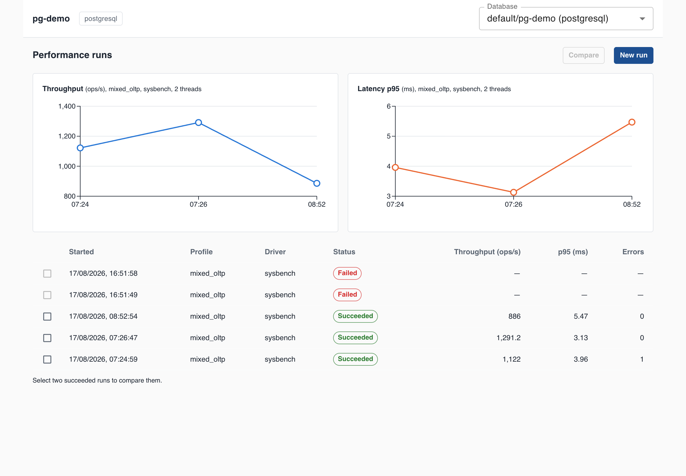
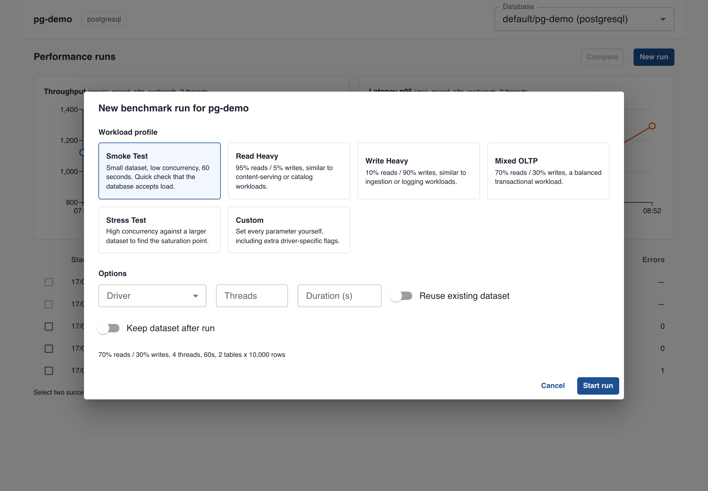
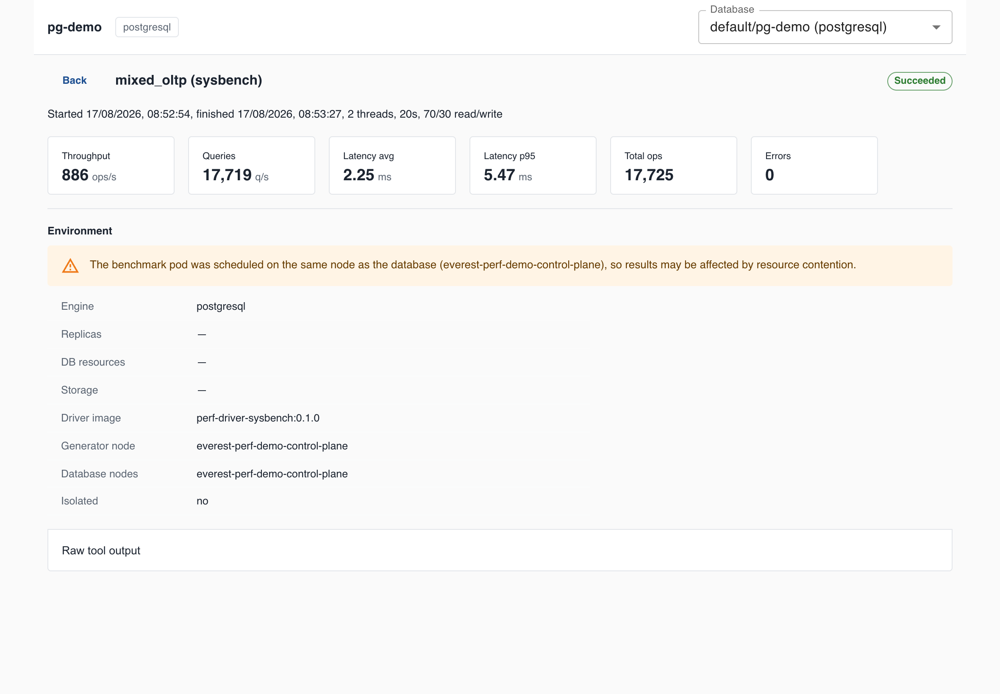
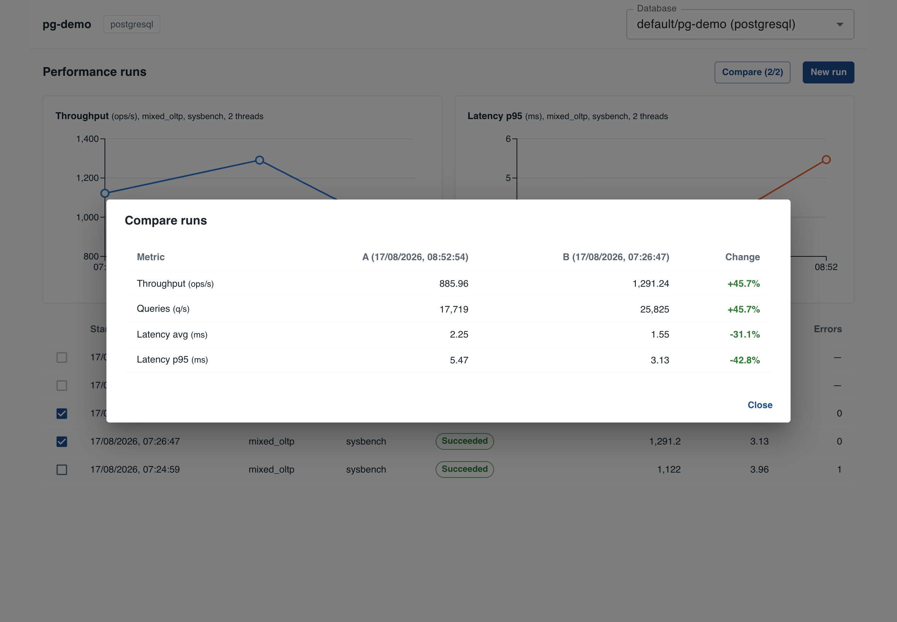

# OpenEverest Performance-Testing Plugin (POC)

Proof of concept for [openeverest/openeverest#2464](https://github.com/openeverest/openeverest/issues/2464),
built for my LFX Mentorship 2026 Term 3 application: benchmark databases managed
by OpenEverest from the dashboard or the CLI. No manual tool installs, no
digging connection strings out of Secrets.

Pick a database, pick a workload profile, run. Results are normalized and
fingerprinted so they can honestly be compared over time.



The trend charts only connect runs with identical settings - runs measured
differently are left out instead of being plotted as if they were comparable.

```
UI (clusterDetailTab) --+
                        +-- plugin backend -- Kubernetes Job (sysbench / go-ycsb)
CLI (everest-perf) -----+        |                   |
                              SQLite store        target database
```

## Try it in ~5 minutes

Prereqs: Go >= 1.25, Node >= 20, Docker, kind, kubectl.

```bash
# 1. Build the frontend bundle and the backend
npm install && npm run build
cp dist/main.js backend/dist/main.js
cd backend && go build -o plugin-backend . && cd ..

# 2. Create a kind cluster with demo databases (PostgreSQL + MongoDB)
#    and load the driver images
./scripts/demo-e2e.sh up

# 3. Start the backend against it (demo-env.sh registers the demo
#    databases as static instances)
source scripts/demo-env.sh && ./backend/plugin-backend

# 4. In a second terminal: the UI sandbox
npm run dev
# open http://localhost:3001/?namespace=default&instance=pg-demo
```

Tear down with `./scripts/demo-e2e.sh down`.

## A run, start to finish

**Start a run.** Users pick a workload shape, not tool flags - the plugin
translates the profile into sysbench or go-ycsb configuration internally.



**Read the result.** Normalized metrics up top, environment fingerprint below.
On this single-node demo cluster the plugin flags that the load generator
shared a node with the database, instead of presenting the number as clean.
The raw tool transcript is kept with every run, so a parsing failure loses
convenience, not data.



**Compare two runs.** Per-metric deltas, green for improvement, red for
regression. If the two runs were measured under different conditions
(different thread count, resources, engine version...), the dialog says so
and lists exactly what differed instead of pretending the numbers are
like-for-like.



## The same thing from CI

```console
$ ./everest-perf run --namespace default --instance pg-demo \
    --profile mixed_oltp --threads 2 --duration 20 --wait \
    --baseline 1139381c-4d6d-46a0-b08b-81d57bede09d --max-regression 10
run 257e871f-1f38-47c3-b234-d1e0812f8438 started (profile=mixed_oltp driver=sysbench)
  status: running
  ...
run 257e871f-1f38-47c3-b234-d1e0812f8438  [succeeded]
  throughput: 1291.2 ops/s
  queries:    25824.8 q/s
  latency:    avg 1.55 ms, p95 3.13 ms
  total ops:  25834 (errors: 0)
baseline check ok (throughput Δ 15.1%)
$ echo $?
0
```

Exit codes are the CI integration: 0 ok, 1 usage/transport error, 2 run
failed, 3 threshold or regression violated. A pipeline step fails
automatically when the database got slower than its stored baseline.

```bash
go build -o everest-perf ./backend/cmd/everest-perf
./everest-perf run --namespace default --instance pg-demo --profile smoke --wait
./everest-perf list --namespace default --instance pg-demo
./everest-perf compare --a <id> --b <id>
```

## What this POC demonstrates

- **Workload profiles instead of tool flags** - Smoke, Read Heavy, Write
  Heavy, Mixed OLTP, Stress, Custom. A profile resolves to an
  engine-independent `RunSpec`; the driver translates it.
- **Two drivers behind one narrow interface** -
  [`sysbench`](backend/internal/driver/sysbench.go) for relational OLTP and
  [`go-ycsb`](backend/internal/driver/ycsb.go) for MongoDB (plus MySQL and
  PostgreSQL). Two drivers keep the
  [`Driver` interface](backend/internal/driver/driver.go) honest; adding a
  third tool touches nothing outside `internal/driver/`.
- **Execution as short-lived Kubernetes Jobs** with pod anti-affinity so the
  load generator stays off the database's node. Whether isolation actually
  held is recorded per run, not assumed.
- **Credentials are never persisted** - resolved at run start, injected via a
  Job-owned Secret, garbage-collected with the Job. They never appear in env
  vars, argv, or the generated script.
- **Environment fingerprints** - every run stores engine version, topology,
  resources, storage class, driver image, workload parameters and generator
  placement. Comparisons between mismatched fingerprints get an explicit
  warning listing what differed.
- **Results in SQLite** behind a
  [`Store` interface](backend/internal/store/model.go), ephemeral by default
  (emptyDir, no PVC unless you opt in via chart values), matching the
  maintainers' guidance on the issue. The interface is the migration path to
  an external PostgreSQL store.

## Repository layout

```
backend/                  Go backend
  main.go                 HTTP server: /main.js, /healthz, /api/...
  internal/driver/        Driver interface + sysbench + go-ycsb
  internal/profile/       Workload profiles -> RunSpec
  internal/runner/        Kubernetes Job lifecycle, anti-affinity, placement capture
  internal/store/         Store interface + SQLite implementation
  internal/everest/       Instance discovery + connection/credential resolution
  internal/server/        HTTP handlers, compare + fingerprint diff
  cmd/everest-perf/       The CI/CD CLI
src/                      React frontend (bundled per plugin contract: one ES module)
charts/performance-plugin Helm chart: Deployment, Service, RBAC, Plugin CR, optional PVC
Dockerfile                Backend image (UI embedded via go:embed)
Dockerfile.sysbench       sysbench driver image
Dockerfile.ycsb           go-ycsb driver image
test-plugin.yaml          Local-dev Plugin CR (externalUrl + vite dev server)
docs/architecture.md      Design decisions and trade-offs
docs/demo-script.md       A rehearsed ~6 minute demo walkthrough
scripts/demo-e2e.sh       End-to-end demo environment on kind
```

## API

| Method & path | Purpose |
|---|---|
| `GET /api/instances` | Everest-managed databases (engine, version, readiness) |
| `GET /api/profiles` | Workload profiles with defaults |
| `GET /api/drivers` | Available drivers and engine support |
| `POST /api/runs` | Start a run (profile + overrides, optional explicit connection) |
| `GET /api/runs?instance=` | Run history |
| `GET /api/runs/{id}` | Run detail: status, normalized result, fingerprint |
| `GET /api/runs/{id}/output` | Raw tool output |
| `POST /api/runs/{id}/cancel` | Cancel a running benchmark |
| `GET /api/compare?a=&b=` | Deltas + fingerprint diff |

## Installing into OpenEverest

```bash
helm install performance charts/performance-plugin -n everest-system
```

That deploys the backend, its RBAC (own ServiceAccount + least-privilege
ClusterRole: jobs, pods, pods/log, secrets, databaseclusters) and the
`Plugin` CR (`extensions.openeverest.io/v1alpha1`) pointing at the backend's
Service. The host proxies `/v1/plugins/performance/...` to the backend and
dynamic-import()s `/main.js`, which registers a Performance tab on the
database detail page.

For iterating against a local k3d-hosted Everest,
`kubectl apply -f test-plugin.yaml` points the CR at your laptop instead.

Against a real Everest install the plugin discovers `DatabaseCluster` CRs and
resolves credentials from the engine's user secret, the same way the Everest
credentials endpoint does. The demo uses plain StatefulSets registered as
static instances; standalone mode also accepts explicit connection details
(see `docs/architecture.md#standalone-mode`).

## Tests

```bash
cd backend && go test ./...
```

Covers the output parsers (against real sysbench/go-ycsb transcripts), script
generation (including "password never appears in the script"), profile
resolution, the SQLite store round-trip, and Job construction (anti-affinity
modes, no-retry policy, Job-owned credential Secret) against a fake clientset.

## Design notes

The reasoning behind the shape of this POC - single plugin with per-engine
drivers, Jobs as the execution model, fingerprint-gated comparisons,
ephemeral-default storage, and the security caveats of the current plugin
proxy - is written up in [docs/architecture.md](docs/architecture.md).
